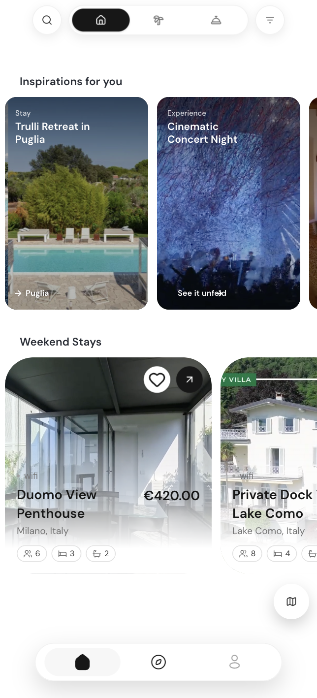
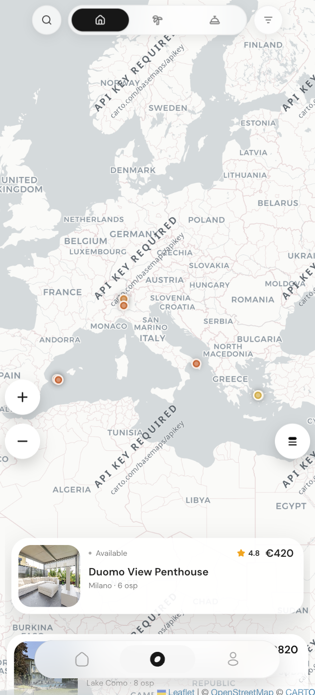

  <table>
    <tr>
      <td align="center" width="100%">
         
        
          
      </td>
    </tr>
  </table>

  <h3>Powered by the sky.</h3>

  

    The intelligence layer for hospitality. 
    Discovery, booking, and operations — real-time, AI-native, built to scale.
  

  

    <a href="https://tatallo.com">tatallo.com</a>
    ·
    <a href="https://github.com/tatallo-org">github.com/tatallo-org</a>
  

 

  <table>
    <tr>
      <td align="center" valign="top" width="240">
        
      </td>
      <td align="center" valign="top" width="240">
        
      </td>
    </tr>
  </table>

